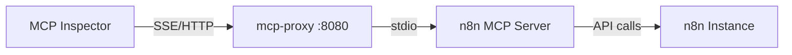

# MCP Proxy Setup Guide

This guide shows how to use the official [mcp-proxy](https://github.com/sparfenyuk/mcp-proxy) to bridge between your n8n MCP server and MCP clients like MCP Inspector.

## Overview

The official `mcp-proxy` is a mature solution that bridges between:
- **stdio MCP servers** (like our n8n server)
- **SSE/HTTP transports** (what MCP Inspector expects)

Instead of implementing our own SSE proxy, we use this battle-tested solution.

## Installation

The mcp-proxy is already installed as part of the setup:

```bash
pip install mcp-proxy
```

## Quick Start

### 1. Start the MCP Proxy

This starts a proxy server that runs your n8n MCP server internally and exposes it via SSE:

```powershell
# Start proxy on default port 8080
npm run proxy

# Or start with CORS enabled for web access
npm run proxy:open

# Or manually with custom settings
powershell -ExecutionPolicy Bypass -File scripts/start-mcp-proxy.ps1 -Port 8081 -AllowAll
```

### 2. Connect MCP Inspector

In a **new terminal window**:

```powershell
# Connect via SSE (recommended)
npm run inspector

# Or connect via StreamableHTTP
npm run inspector:http

# Or manually with custom settings
powershell -ExecutionPolicy Bypass -File scripts/connect-inspector-to-proxy.ps1 -Transport sse -ProxyPort 8080
```

## How It Works



1. **MCP Inspector** connects to the proxy via SSE or HTTP
2. **mcp-proxy** translates between SSE/HTTP and stdio
3. **n8n MCP Server** receives stdio messages and makes n8n API calls
4. **n8n Instance** executes workflows and returns results

## Available Endpoints

When the proxy is running on port 8080:

- **SSE Endpoint**: `http://localhost:8080/sse`
- **StreamableHTTP Endpoint**: `http://localhost:8080/mcp`
- **Health Check**: `http://localhost:8080/health` (if implemented)

## Configuration

### Environment Variables

The proxy automatically sets these environment variables for the n8n server:

```bash
N8N_API_URL=https://n8n.boris-spiegl.workers.dev/api/v1
N8N_API_KEY=tGhOC7BxdXn3a0LbVLOpjZe06oTJuKQ8pI4lYRz6n8c
```

### Proxy Options

```powershell
# Basic options
scripts/start-mcp-proxy.ps1 -Port 8080 -ProxyHost "127.0.0.1"

# Enable CORS for web access
scripts/start-mcp-proxy.ps1 -AllowAll

# Inspector options
scripts/connect-inspector-to-proxy.ps1 -Transport sse -ProxyPort 8080 -InspectorPort 8276
```

## Troubleshooting

### 1. Proxy Won't Start

**Error**: `mcp-proxy: command not found`
**Solution**: Install the proxy:
```bash
pip install mcp-proxy
```

**Error**: `node build/index.js: No such file`
**Solution**: Build the project:
```bash
npm run build
```

### 2. Inspector Can't Connect

**Error**: Connection refused
**Solution**: Make sure the proxy is running first:
```powershell
# Terminal 1: Start proxy
npm run proxy

# Terminal 2: Connect inspector
npm run inspector
```

### 3. Port Conflicts

**Error**: Port already in use
**Solution**: Use a different port:
```powershell
scripts/start-mcp-proxy.ps1 -Port 8081
scripts/connect-inspector-to-proxy.ps1 -ProxyPort 8081
```

### 4. Environment Issues

**Error**: n8n API connection fails
**Solution**: Check environment variables in the proxy script:
```powershell
# Edit scripts/start-mcp-proxy.ps1 and update:
$env:N8N_API_URL = "your-n8n-url"
$env:N8N_API_KEY = "your-api-key"
```

### 5. Transport Issues

If SSE has problems, try StreamableHTTP:
```powershell
npm run inspector:http
```

## Benefits of Official mcp-proxy

✅ **Mature & Tested** - 1.1k+ stars, actively maintained
✅ **Standards Compliant** - Follows official MCP transport specifications  
✅ **Multiple Transports** - Supports both SSE and StreamableHTTP
✅ **Production Ready** - Used by many MCP implementations
✅ **No Custom Code** - No need to maintain our own proxy implementation

## Advanced Usage

### Multiple Named Servers

You can run multiple MCP servers through one proxy:

```bash
mcp-proxy --port 8080 \
  --named-server n8n "node build/index.js" \
  --named-server fetch "uvx mcp-server-fetch"
```

Then connect to specific servers:
- n8n: `http://localhost:8080/servers/n8n/sse`
- fetch: `http://localhost:8080/servers/fetch/sse`

### Docker Deployment

```bash
docker run -p 8080:8080 -e N8N_API_URL="your-url" -e N8N_API_KEY="your-key" \
  ghcr.io/sparfenyuk/mcp-proxy:latest \
  --port 8080 --host 0.0.0.0 --allow-origin "*" -- node build/index.js
```

## Next Steps

Once you have the proxy working:

1. **Configure AI Assistants** to connect to `http://localhost:8080/sse`
2. **Deploy to Production** using the Docker image or cloud hosting
3. **Add Authentication** if exposing publicly
4. **Monitor Performance** using the proxy's built-in logging 